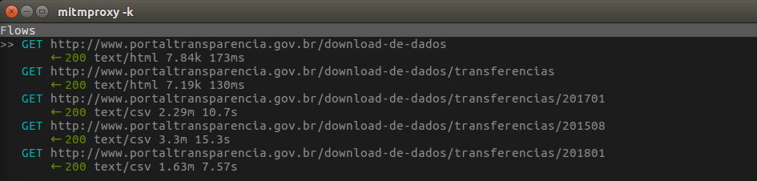

## Passo-a-passo

Versão do Python: 3.6.6

1. `git clone https://github.com/giuliocc/transparencia.git`
2. `pip3 install -r requirements.txt`
3. `scrapy startproject transparencia`
4. `cd transparencia/transparencia/spiders`
5. `scrapy genspider planilhas`
6. Analise o fluxo de [download de planilhas no site](www.portaltransparencia.gov.br/download-de-dados) com alguma ferramenta (aba "Network" do browser, Postman, Mitmproxy, etc., eu prefiro o Mitmproxy)

    6.1. O fluxo deverá se parecer com o seguinte:
        
7. Siga os três commits iniciais deste repositório e veja as alterações feitas em cada um
8. A partir do quarto commit, é necessário [criar uma conta na AWS](https://aws.amazon.com/pt/console/) e [criar um usuário IAM](https://docs.aws.amazon.com/IAM/latest/UserGuide/id_users_create.html)

    8.1. Guarde as seguintes informações do usuário IAM criado: "user arn", "access key id" e "secret access key"

    8.2. Nunca disponibilize estes dados publicamente!
9. [Crie um bucket no S3](https://docs.aws.amazon.com/pt_br/AmazonS3/latest/user-guide/create-bucket.html)
10. Adicione o arquivo .env na mesma pasta do arquivo settings.py com a `ACCESS_KEY_ID` e `SECRET_ACCESS_KEY` do usuário IAM
11. Siga os commits até o sétimo commit, vendo todas as alterações feitas de um commit para o outro, para entender a lógica.
12. No sétimo commit, já é possível fazer o upload de planilhas do tópico escolhido pro S3, executando `python run.py`

    12.1. Para fazer o upload de todas as disponíveis, execute `python run.py` com a linha `process.crawl(PlanilhasSpider, all=True)` descomentada e a linha `process.crawl(PlanilhasSpider)` comentada

    12.2. Para fazer o uploade apenas do dia atual, execute `python run.py` normalmente

13. No sétimo commit, também já é possível hospedar este código no Heroku.
14. Crie uma conta no Heroku
15. [Associe o Heroku ao repositório (criando app)](https://devcenter.heroku.com/articles/getting-started-with-python)
16. [Adicione as variáveis de ambiente `ACCESS_KEY_ID` e `SECRET_ACCESS_KEY` do usuário IAM da AWS no app Heroku](https://devcenter.heroku.com/articles/config-vars)
17. Adicione o addon "Heroku Scheduler" na aba "Resources" do app Heroku
18. Faça o Heroku Scheduler executar o comando `python run.py` diariamente no horário desejado
19. Após estes passos, seu sistema de extração automática de dados do Portal da Transparência está pronto
20. Para realizar as análises, faça download dos arquivos armazenados no S3 (usar o programa awscli é mais prático)
21. Dê `unzip` em todos os arquivos baixados
22. Faça suas análises
23. Para alguma referência de como usar os dados das planilhas, há um Jupyter Notebook na pasta "analise"

---

#### Qualquer dúvida, sugestão, reclamação, xingamento, etc., envie um email para gcc@cin.ufpe.br

---

Autores:
- Giulio Carvalho Cavalcante
- Iury Adones Xavier dos Santos